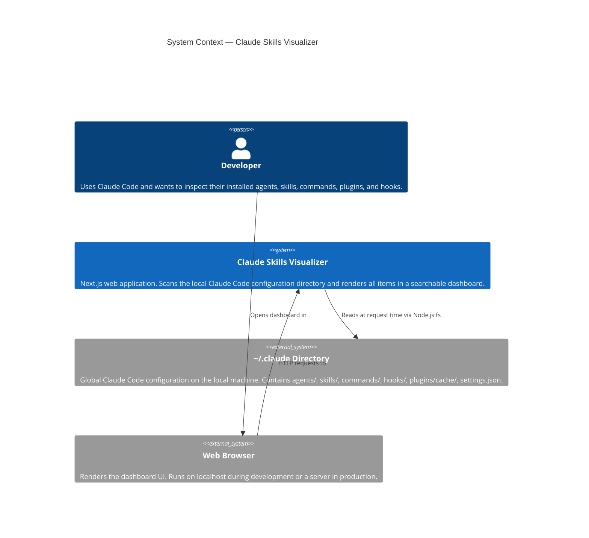
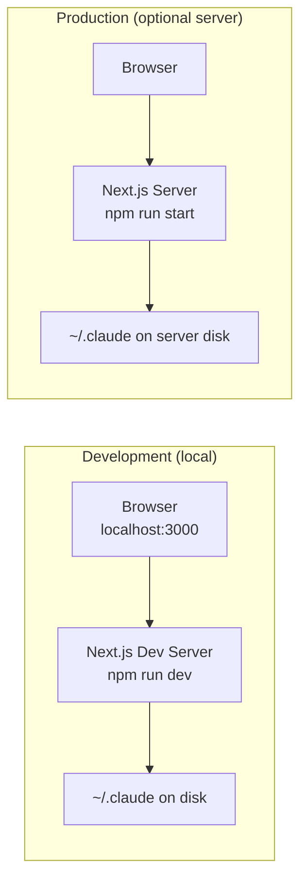
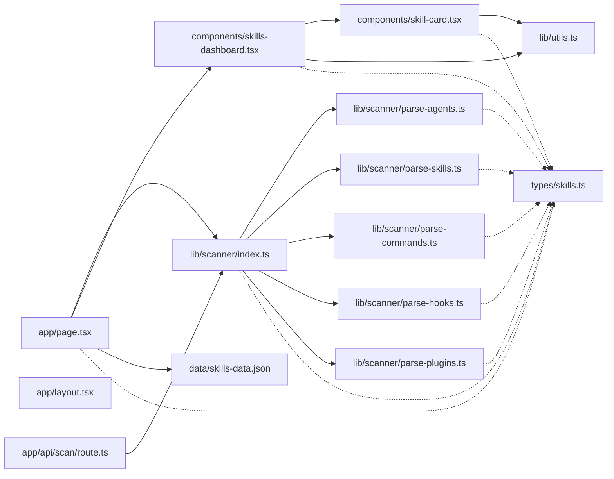

# 01 — System Overview

## Purpose

**Claude Skills Visualizer** is a developer-facing internal tool that provides a single operational view of every Claude Code configuration item installed on a machine. It scans the `~/.claude` global configuration directory, parses agents, skills, commands, plugins, and hooks, then presents them in a filterable card grid with live rescan capability.

The primary audience is developers who maintain or extend Claude Code setups and want to audit, explore, or share their configuration without navigating raw filesystem directories.

---

## System Context Diagram



---

## High-Level Architecture

```mermaid
graph TB
    subgraph Filesystem["Local Filesystem (~/.claude)"]
        A1[agents/*.md]
        A2[skills/*/skill.md]
        A3[commands/*.md]
        A4[hooks/hooks.json]
        A5[plugins/cache/]
        A6[settings.json / settings.local.json]
    end

    subgraph Scanner["src/lib/scanner/ — Server-side"]
        S0[index.ts\nscanClaudeConfig]
        S1[parse-agents.ts]
        S2[parse-skills.ts]
        S3[parse-commands.ts]
        S4[parse-hooks.ts]
        S5[parse-plugins.ts]
        S0 --> S1
        S0 --> S2
        S0 --> S3
        S0 --> S4
        S0 --> S5
    end

    subgraph NextJS["Next.js App Router"]
        P[page.tsx\nServer Component\nforce-dynamic]
        API[/api/scan\nRoute Handler]
        P -->|"calls"| S0
        API -->|"calls"| S0
    end

    subgraph UI["Client Components"]
        DASH[SkillsDashboard\nuseState · useMemo · useCallback]
        CARD[SkillCard\nexpandable detail]
        DASH -->|"renders"| CARD
    end

    subgraph Types["Type System"]
        T[src/types/skills.ts\nSkillItem · SkillsData · Category]
    end

    subgraph Fallback["Static Fallback"]
        JSON[src/data/skills-data.json]
    end

    A1 --> S1
    A2 --> S2
    A3 --> S3
    A4 --> S4
    A5 --> S5
    A6 --> S5

    S0 -->|"SkillsData"| P
    P -->|"props"| DASH
    JSON -->|"used if scan empty"| P

    DASH -->|"GET /api/scan"| API
    API -->|"JSON response"| DASH

    S0 -.->|"typed by"| T
    DASH -.->|"typed by"| T
    CARD -.->|"typed by"| T
```

---

## Deployment Architecture



> **Note:** This app is designed as a local developer tool. The `~/.claude` path resolves to `os.homedir() + "/.claude"` at runtime, so both dev and prod must run on a machine that has Claude Code installed.

---

## Module Dependency Map



---

## Rendering Strategy

The app uses Next.js **App Router** with a deliberate mix of Server and Client Components:

| Layer | Component | Rendering | Reason |
|---|---|---|---|
| Page shell | `layout.tsx` | Server | Font injection, `<html>` wrapper |
| Data entry point | `page.tsx` | Server (`force-dynamic`) | Needs `fs` access + per-request freshness |
| Interactive dashboard | `SkillsDashboard` | Client (`"use client"`) | Owns search/filter/rescan state |
| Display leaf | `SkillCard` | Client (`"use client"`) | Owns expand/collapse toggle state |
| API rescan | `/api/scan` | Server (Route Handler) | Server-side `fs` access from browser fetch |
