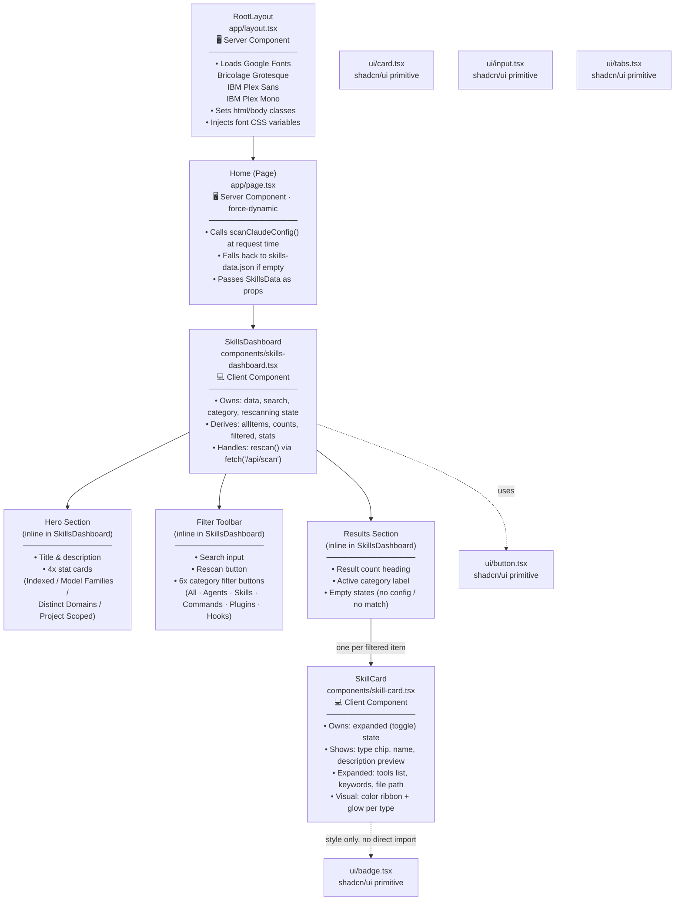
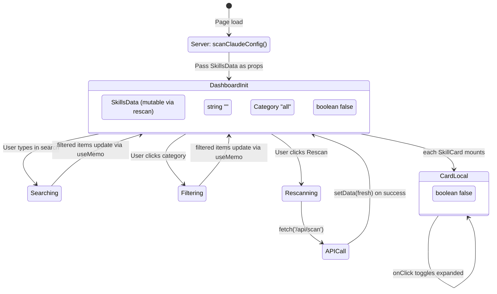
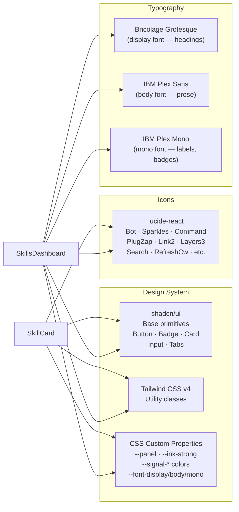

# 02 — Component Hierarchy

## React Component Tree

---

## Component Responsibilities

### `RootLayout` (`app/layout.tsx`)

Server Component. Static shell. Sole responsibility is injecting the three Google Font families as CSS custom properties (`--font-display`, `--font-body`, `--font-mono`) and applying antialiasing. It never receives or processes data.

### `Home` (`app/page.tsx`)

Server Component marked `force-dynamic` so Next.js re-runs it on every request (no caching). It:
1. Calls `scanClaudeConfig()` which reads the filesystem via Node.js `fs/promises`.
2. Checks if any data was returned; falls back to the bundled `skills-data.json` if not.
3. Passes the resulting `SkillsData` object to `SkillsDashboard` as props.

### `SkillsDashboard` (`components/skills-dashboard.tsx`)

The central Client Component. All UI interactivity lives here. It manages:

| State | Type | Purpose |
|---|---|---|
| `data` | `SkillsData` | Current dataset (initialised from SSR props) |
| `search` | `string` | Current search query |
| `category` | `Category` | Active filter tab |
| `rescanning` | `boolean` | Loading indicator for rescan button |

Derived values (all via `useMemo`):

| Derived | Purpose |
|---|---|
| `allItems` | Flattened array of all item types |
| `counts` | Per-category item counts for filter badges |
| `uniqueDomains` | Distinct domain/marketplace count for stats |
| `modelFamilies` | Distinct model family count for stats |
| `projectScoped` | Count of items with `source === "project"` |
| `filtered` | Search + category filtered items to render |
| `activeCategoryLabel` | Display name for the active category |

### `SkillCard` (`components/skill-card.tsx`)

Leaf display component. Owns only one piece of state: `expanded` (boolean toggle). Renders:
- A color-coded top ribbon (by type)
- Type chip badge
- Name and description (truncated to 130 chars when collapsed)
- Source, domain, model, status, version metadata badges
- Expandable detail panel with tools list, keywords, and file path

---

## State Ownership Map

---

## UI Layer Map

