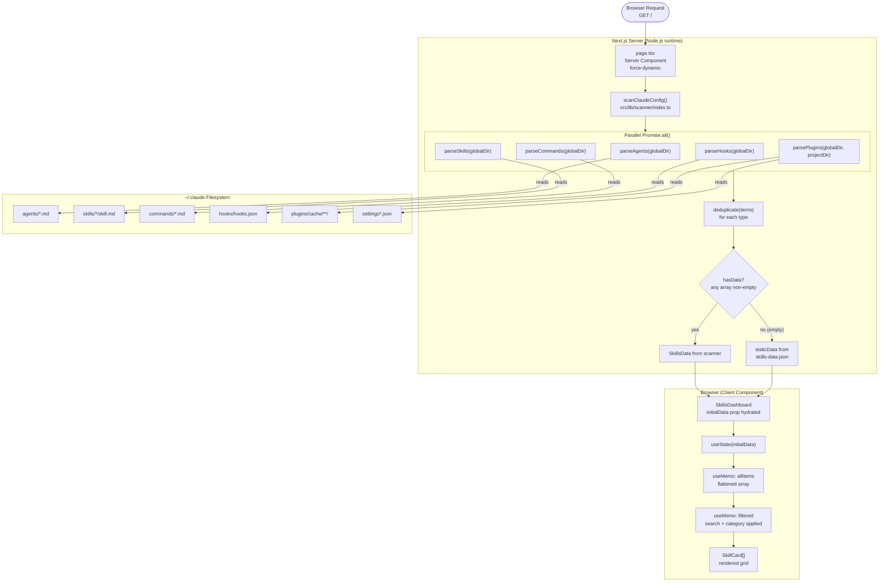
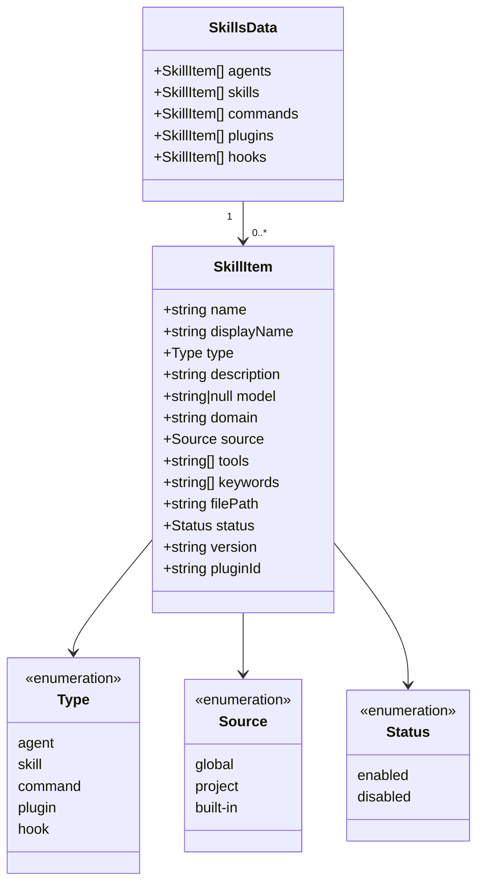
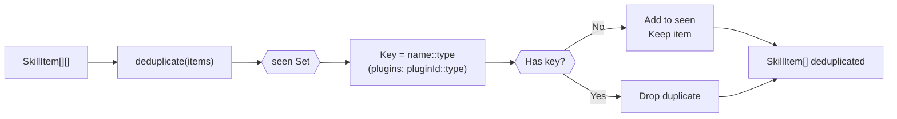
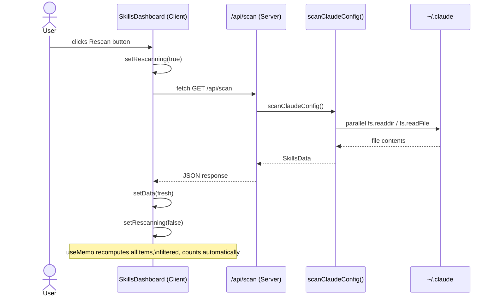
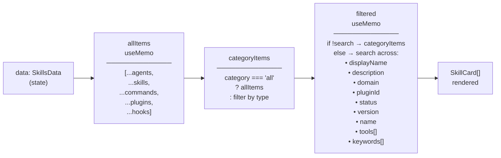

# 03 — Data Flow

## End-to-End Data Flow



---

## Data Shape Transformations

Each parser transforms raw filesystem artifacts into the canonical `SkillItem` type.

### `SkillItem` — Canonical Shape



---

## Per-Parser Data Transformation

### Agents (`parse-agents.ts`)

```
~/.claude/agents/<name>.md
  ↓  gray-matter parses YAML frontmatter
  ↓  Extracts: name, description, model, tools
  ↓  Derives displayName via kebab→Title Case
  →  SkillItem { type: "agent", source: "global" }
```

**Frontmatter fields read:**
- `name` (fallback: filename without `.md`)
- `description`
- `model`
- `tools` (array)

### Skills (`parse-skills.ts`)

```
~/.claude/skills/<skill-name>/skill.md   (case-insensitive match)
  ↓  gray-matter parses YAML frontmatter
  ↓  Extracts: name, description, model, tools/allowed-tools
  ↓  tools: splits comma-string OR accepts array
  →  SkillItem { type: "skill", source: "global" }
```

**Frontmatter fields read:**
- `name` (fallback: directory name)
- `description`
- `model`
- `tools` OR `allowed-tools` (string or array)

### Commands (`parse-commands.ts`)

```
~/.claude/commands/<name>.md
  ↓  Raw text parse (no frontmatter)
  ↓  Extracts: H1 heading → displayName
  ↓  First non-header paragraph → description
  ↓  Strips blockquote markers (>)
  →  SkillItem { type: "command", model: null, tools: [] }
```

### Hooks (`parse-hooks.ts`)

```
~/.claude/hooks/hooks.json
  ↓  JSON.parse
  ↓  Each top-level key = event name
  ↓  Extracts: hook types, matchers
  →  SkillItem per event { type: "hook", tools: [] }
```

**JSON structure expected:**
```json
{
  "EventName": [
    {
      "matcher": "optional-pattern",
      "hooks": [{ "type": "shell", "command": "..." }]
    }
  ]
}
```

### Plugins (`parse-plugins.ts`)

```
Reads from two sources concurrently:
  1. settings.json / settings.local.json → enabledPlugins map
  2. ~/.claude/plugins/cache/<marketplace>/<name>/<version>/ → installed map

Merges both maps by pluginId (name@marketplace):
  - enabled but not installed → still listed (disabled or enabled)
  - installed but not in settings → listed as disabled
  - Both → merged with installed metadata taking priority for description/version

Picks latest version by mtime when multiple release dirs exist.
  →  SkillItem { type: "plugin", domain: marketplace, status, version, pluginId }
```

---

## Deduplication Logic



The deduplication key for plugins uses `pluginId` (which is `name@marketplace`) rather than just `name` to allow plugins from different marketplaces with the same name to coexist.

---

## Rescan Data Flow



---

## Filter Pipeline


