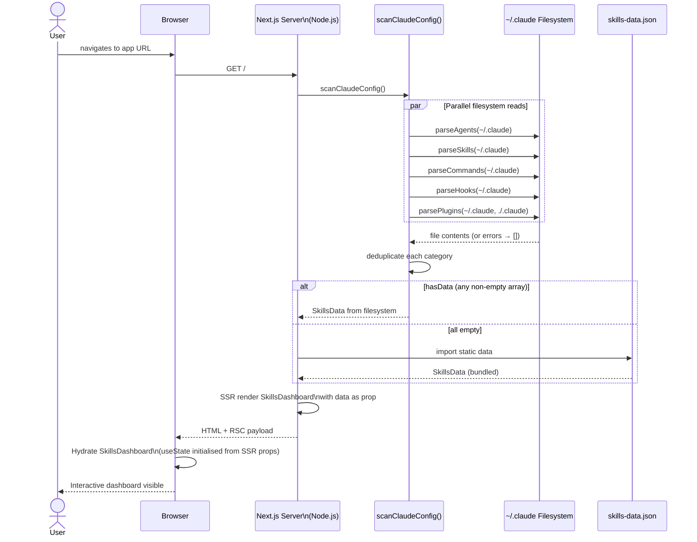
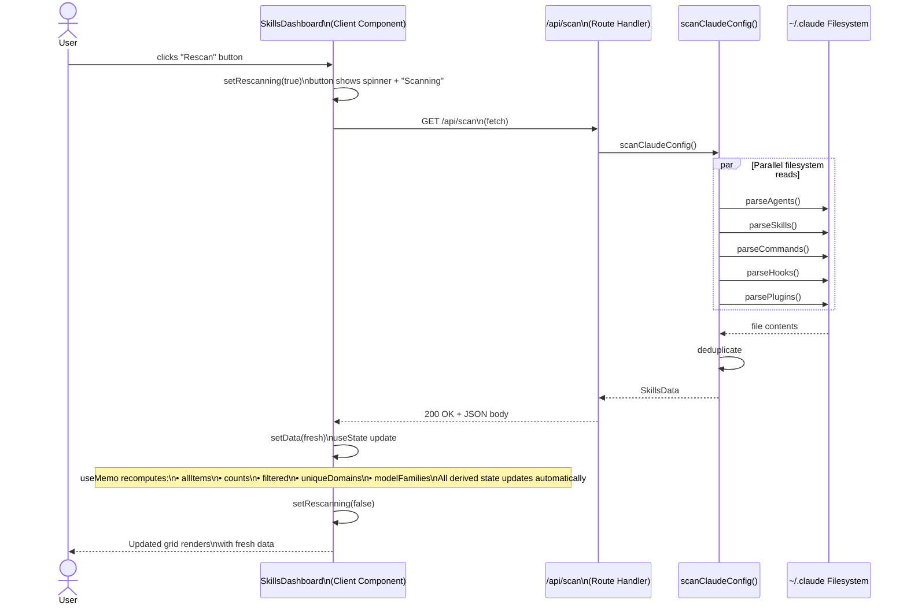
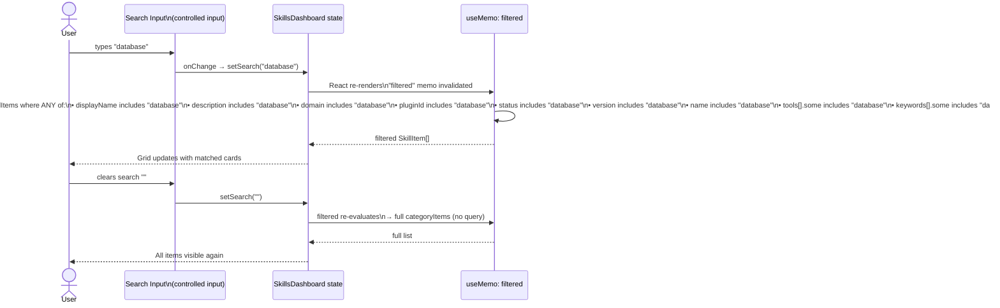
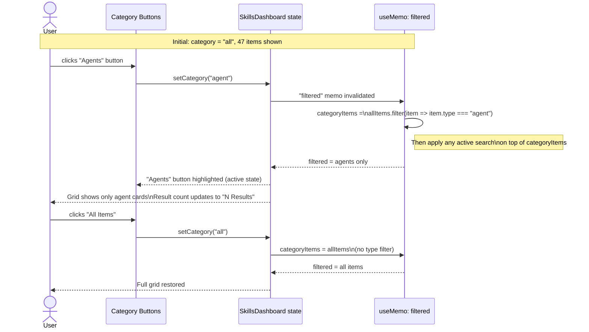
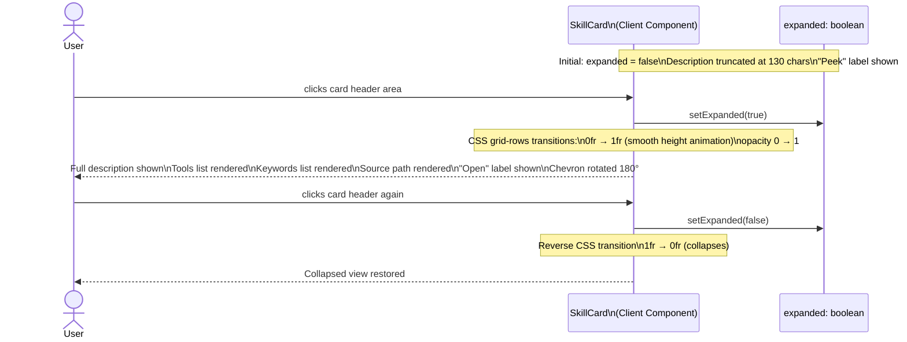
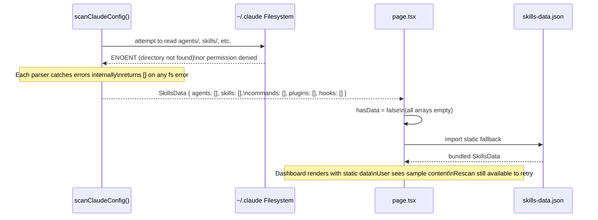

# 04 — Sequence Diagrams

## 1. Initial Page Load

The primary render path. The server reads the filesystem, SSR-renders the dashboard with real data, and hydrates on the client.

---

## 2. Live Rescan

Triggered when the user clicks the **Rescan** button. A client-side fetch hits the API route, which re-runs the scanner.

---

## 3. Search Interaction

Real-time search filtering — no debounce, no server call. Pure client-side derived state.

---

## 4. Category Filter

Switching tabs changes the category state, which drives `filtered` via `useMemo`.

---

## 5. Card Expand/Collapse

Each card manages its own local state. Independent of the dashboard.

---

## 6. Error Paths

