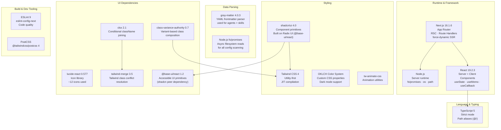
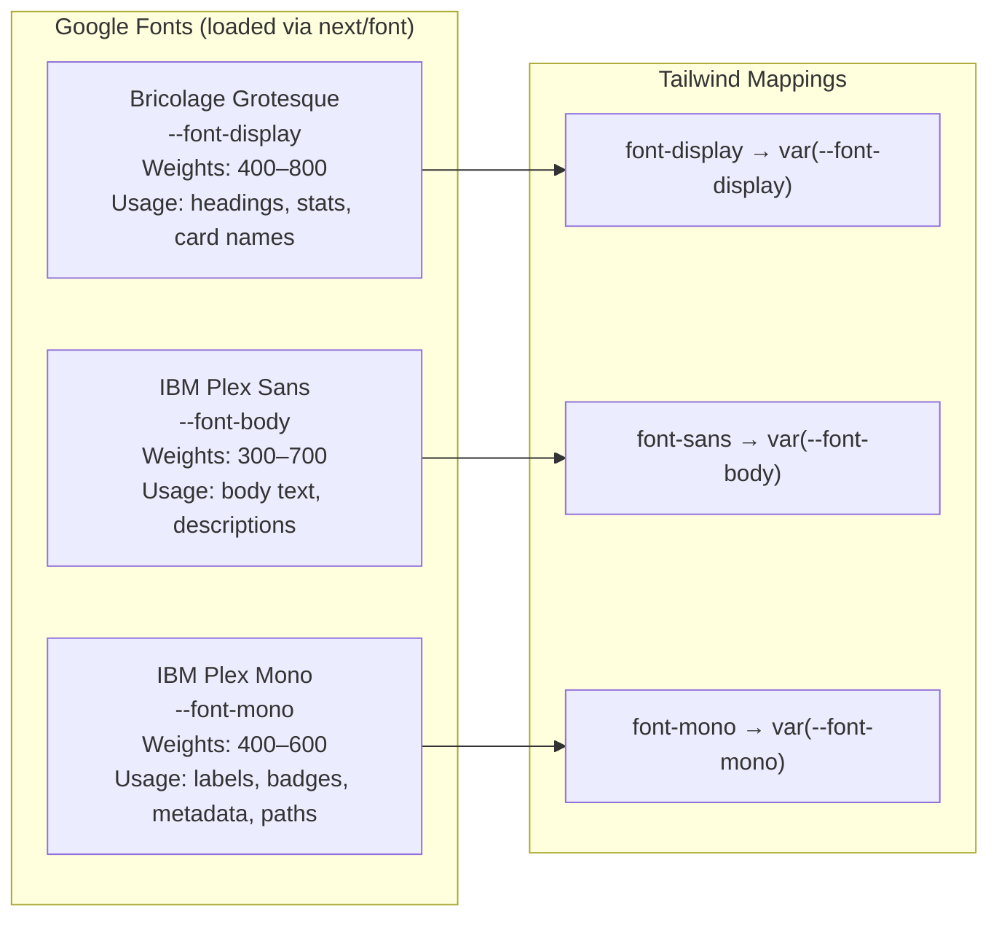

# 05 — Tech Stack

## Stack Overview



---

## Dependency Table

### Runtime Dependencies

| Package | Version | Purpose |
|---|---|---|
| `next` | `16.1.6` | App framework, SSR, routing |
| `react` | `19.2.3` | UI library |
| `react-dom` | `19.2.3` | DOM renderer |
| `gray-matter` | `^4.0.3` | YAML frontmatter parsing for `.md` files |
| `lucide-react` | `^0.577.0` | Icon set |
| `class-variance-authority` | `^0.7.1` | Type-safe variant composition |
| `clsx` | `^2.1.1` | Conditional classNames |
| `tailwind-merge` | `^3.5.0` | Tailwind dedup/merge utility |
| `tw-animate-css` | `^1.4.0` | Pre-built animation classes |
| `shadcn` | `^4.0.0` | Component system CLI + styles |
| `@base-ui/react` | `^1.2.0` | Accessible headless UI primitives |

### Dev Dependencies

| Package | Version | Purpose |
|---|---|---|
| `typescript` | `^5` | Type system |
| `@types/node` | `^20` | Node.js type definitions |
| `@types/react` | `^19` | React type definitions |
| `@types/react-dom` | `^19` | ReactDOM type definitions |
| `tailwindcss` | `^4` | CSS framework |
| `@tailwindcss/postcss` | `^4` | Tailwind PostCSS plugin |
| `eslint` | `^9` | Linter |
| `eslint-config-next` | `16.1.6` | Next.js ESLint rules |

---

## Architecture Decision Record — Key Choices

### ADR-01: Next.js App Router over Pages Router

**Decision:** Use App Router with Server Components and `force-dynamic`.

**Rationale:** Server Components run on the server with access to `fs`, enabling direct filesystem reads without a separate API call for the initial render. `force-dynamic` ensures per-request freshness so the dashboard always reflects the current state of `~/.claude`.

**Trade-off:** Larger framework surface vs. simpler Pages Router. Accepted because RSC boundary provides clean separation of server (scan) and client (interact) concerns.

---

### ADR-02: Gray-matter for Frontmatter Parsing

**Decision:** Use `gray-matter` to parse YAML frontmatter from `.md` files.

**Rationale:** Claude Code agent and skill definitions use YAML frontmatter (`---`) for metadata. `gray-matter` is the de-facto standard parser for this format in the JavaScript ecosystem, battle-tested and zero-config.

**Trade-off:** Additional dependency. Accepted because manual YAML parsing is error-prone.

---

### ADR-03: Static JSON Fallback

**Decision:** Bundle `src/data/skills-data.json` as a fallback dataset.

**Rationale:** If the app is run on a machine without `~/.claude` configured, or the scanner returns empty, the UI should still be meaningful and demonstrate its capabilities. The static data acts as sample content.

**Trade-off:** Bundled data may become stale. Accepted because the Rescan button always provides a path to live data.

---

### ADR-04: Client-side Filtering Only

**Decision:** All search and category filtering happens in the browser via `useMemo`, not via server queries or URL params.

**Rationale:** The full dataset fits comfortably in memory (tens to hundreds of items). Client-side filtering is instant, requires no network round-trips, and avoids URL state complexity. This is appropriate for a single-user local tool.

**Trade-off:** Not suitable for large datasets (1000s of items). Acceptable given the domain.

---

### ADR-05: OKLCH Color System

**Decision:** Use `oklch()` color functions throughout `globals.css`.

**Rationale:** OKLCH provides perceptually uniform color space, making it easier to create color scales that feel visually consistent. Dark mode variants are derived by adjusting the lightness channel systematically, producing more predictable results than HSL.

---

## Typography System



---

## Color System

Signal colors are used consistently to identify item types across ribbons, chips, and glows:

| CSS Variable | Color | Used For |
|---|---|---|
| `--signal-cyan` | Cyan | Agent type |
| `--signal-amber` | Amber | Skill type + Model Families stat |
| `--signal-rose` | Rose | Command type |
| `--signal-emerald` | Emerald | Plugin type + Distinct Domains stat |
| `--signal-blue` | Blue | Hook type + Project Scoped stat |
| `--signal-cyan` | Cyan | Indexed Entries stat |

---

## File Conventions

```
/
├── src/
│   ├── app/                    # Next.js App Router
│   │   ├── layout.tsx          # Root layout (Server Component)
│   │   ├── page.tsx            # Home page (Server Component)
│   │   ├── globals.css         # Global styles + CSS custom properties
│   │   └── api/
│   │       └── scan/
│   │           └── route.ts    # GET /api/scan (Route Handler)
│   ├── components/
│   │   ├── skills-dashboard.tsx  # Primary Client Component
│   │   ├── skill-card.tsx        # Card leaf Client Component
│   │   └── ui/                   # shadcn/ui primitives
│   ├── lib/
│   │   ├── utils.ts              # cn() helper (clsx + tailwind-merge)
│   │   └── scanner/              # Filesystem scanning module
│   ├── types/
│   │   └── skills.ts             # Shared TypeScript interfaces
│   └── data/
│       └── skills-data.json      # Static fallback dataset
├── public/                       # Static assets (SVGs)
├── docs/
│   ├── plans/                    # Design documents
│   └── arch/                     # Architecture documentation (this folder)
├── components.json               # shadcn/ui config
├── tsconfig.json                 # TypeScript config (path alias: @/ → src/)
├── eslint.config.mjs             # ESLint config
└── postcss.config.mjs            # PostCSS config
```
