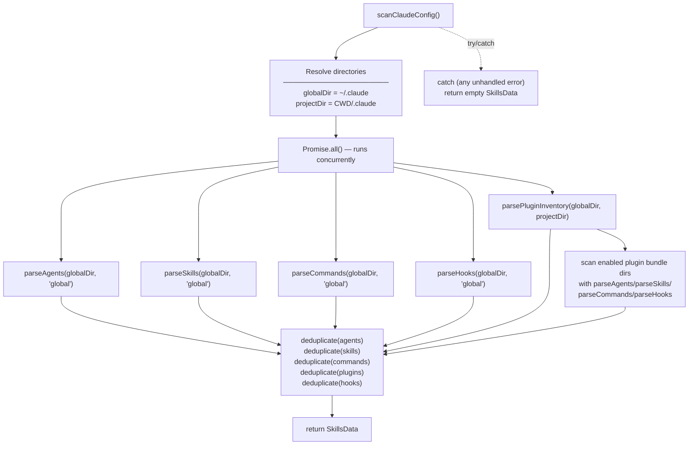
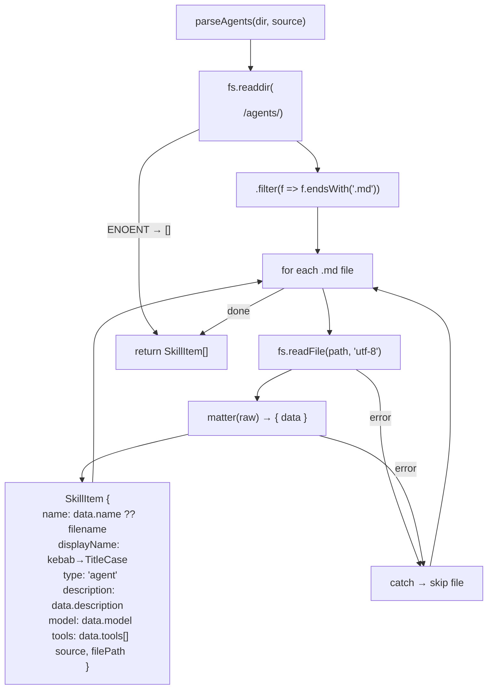
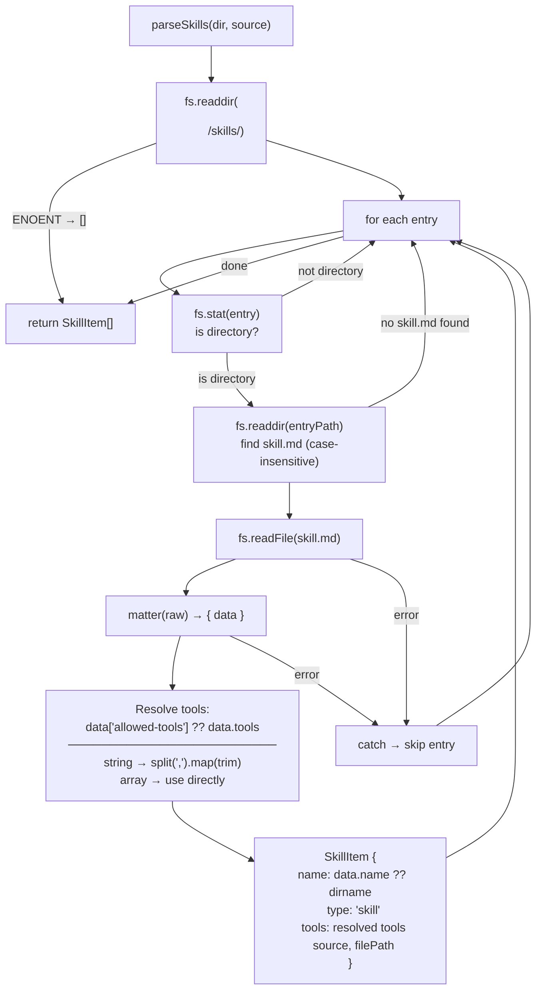
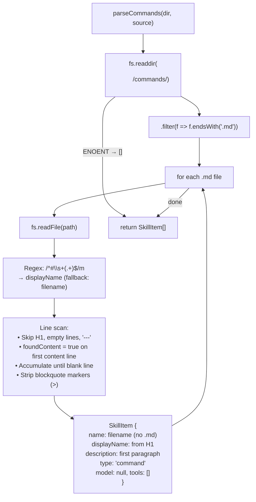
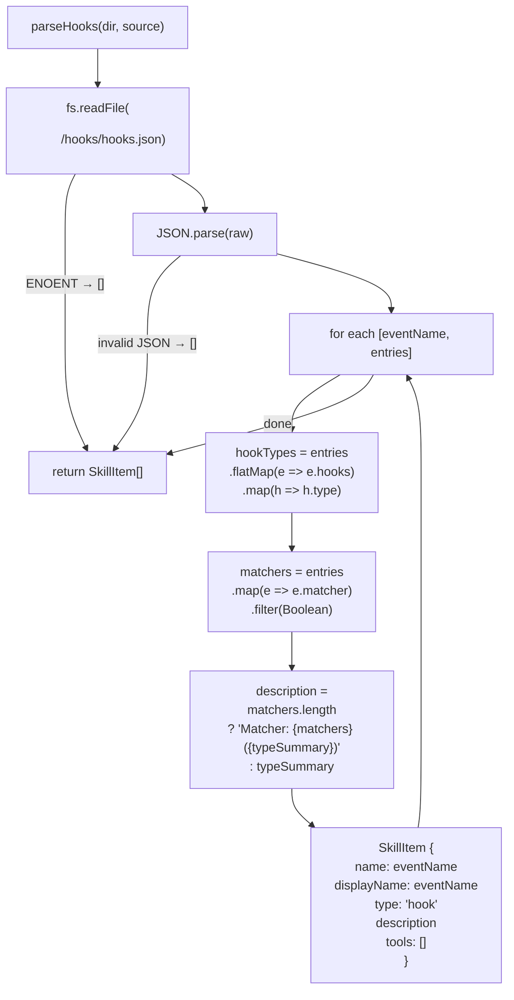
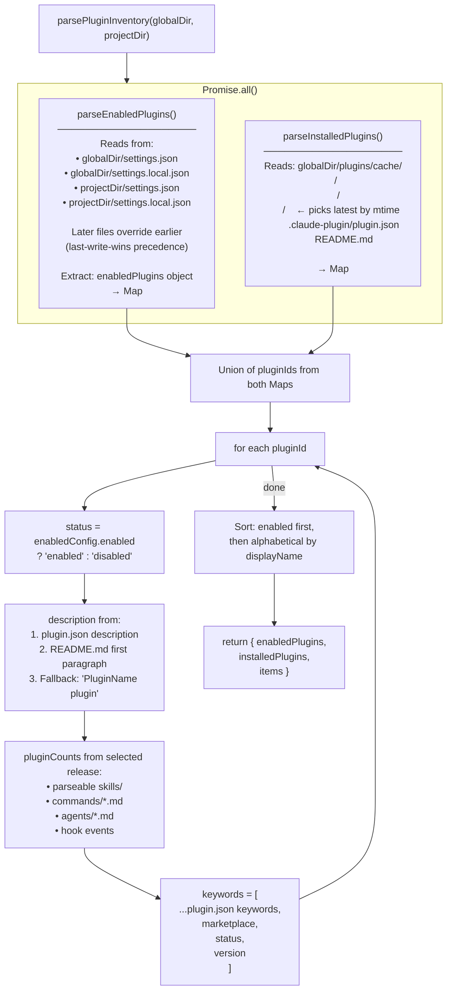

# 06 — Scanner Module

The scanner (`src/lib/scanner/`) is the core server-side subsystem. It reads the local Claude Code configuration from the filesystem and normalises everything into the `SkillsData` shape. It runs inside Next.js Server Components and Route Handlers — never in the browser.

---

## Module Structure

```
src/lib/scanner/
├── index.ts           ← Orchestrator. Calls direct parsers, scans enabled plugin bundles, deduplicates.
├── parse-agents.ts    ← Reads ~/.claude/agents/*.md  (gray-matter frontmatter)
├── parse-skills.ts    ← Reads ~/.claude/skills/*/skill.md  (gray-matter frontmatter)
├── parse-commands.ts  ← Reads ~/.claude/commands/*.md  (plain text extraction)
├── parse-hooks.ts     ← Reads ~/.claude/hooks/hooks.json  (JSON)
└── parse-plugins.ts   ← Reads settings.json files + ~/.claude/plugins/cache/
```

---

## Orchestrator — `index.ts`



**Deduplication key:**
- Standard items: `"${item.name}::${item.type}"`
- Plugins: `"${item.pluginId}::plugin"` (pluginId = `name@marketplace`)
- Plugin-origin items: `"${item.pluginId}::${item.name}::${item.type}"`

---

## Parser: `parse-agents.ts`

Reads every `.md` file inside `<dir>/agents/`, parses YAML frontmatter via `gray-matter`, and maps each file to a `SkillItem`.



**Expected frontmatter:**
```yaml
---
name: my-agent
description: Does something useful
model: sonnet
tools:
  - Read
  - Write
  - Bash
---
```

---

## Parser: `parse-skills.ts`

Skills are stored in *directories*, not single files. Each skill lives at `<dir>/skills/<skill-name>/skill.md` (case-insensitive match for `skill.md` / `SKILL.md`).



**Dual tools field support:** Skills from different plugin systems may use `tools` or `allowed-tools` as the frontmatter key. The parser accepts either.

---

## Parser: `parse-commands.ts`

Commands are plain markdown files without YAML frontmatter. The parser extracts the title from the H1 heading and the description from the first non-empty paragraph.



---

## Parser: `parse-hooks.ts`

Reads `<dir>/hooks/hooks.json`, which is a JSON object where each key is an event name and each value is an array of hook entries.



**Expected `hooks.json` structure:**
```json
{
  "PostToolUse": [
    {
      "matcher": "Bash",
      "hooks": [{ "type": "shell", "command": "echo done" }]
    }
  ],
  "PreToolUse": [
    {
      "hooks": [{ "type": "prompt", "prompt": "Check for issues" }]
    }
  ]
}
```

---

## Parser: `parse-plugins.ts`

The most complex parser. It merges two independent data sources to produce a unified plugin list.



### Plugin Identity Parsing

Plugin IDs use the format `name@marketplace`. The `parsePluginIdentity()` function handles edge cases:

```
"superpowers@claude-plugins-official"
  → name: "superpowers", marketplace: "claude-plugins-official"

"my-plugin"   (no @)
  → name: "my-plugin", marketplace: "unknown"

"@scoped/pkg@registry"  (@ appears in name)
  → splits at the LAST @ to handle scoped names
```

### Version Selection

When a plugin has multiple release directories (e.g. `1.0.0`, `1.2.0`, `2.0.0`), the parser selects the **most recently modified** one by comparing `fs.stat().mtimeMs`. This means the live installed version is always shown, even if older versions remain in the cache directory.

### Enabled Bundle Materialization

After plugin inventory is loaded, the orchestrator performs a second pass:

- Only plugins with `enabled === true` are scanned for bundled items.
- Each enabled plugin must also have an installed `releasePath`.
- The existing parsers are run against that release root, so plugin bundles reuse the same parsing logic as top-level config directories.
- Returned items are annotated with plugin provenance (`pluginId`, `pluginDisplayName`, `pluginVersion`) and preserve the plugin enablement scope (`global` or `project`) as their `source`.

---

## Error Handling Strategy

The scanner follows a **fail-safe, never-throw** design:

| Failure point | Behaviour |
|---|---|
| Directory not found (`ENOENT`) | Parser returns `[]` immediately |
| File read error | Individual file is skipped, loop continues |
| Malformed frontmatter | `gray-matter` may return empty `data`; defaults applied |
| Invalid JSON (hooks/settings) | `JSON.parse` failure caught, returns `[]` |
| Any unhandled exception in `scanClaudeConfig()` | Outer `try/catch` returns fully empty `SkillsData` |

This ensures the dashboard always renders — worst case, it falls back to the static JSON dataset.

---

## Performance Characteristics

- **Parallelism:** All five parsers run concurrently via `Promise.all()`. I/O bound by filesystem speed.
- **Plugin cache scan:** Nested directory traversal (`marketplace → plugin → release`). `Promise.all` is NOT used inside the loop (sequential per-plugin), but the outer call is concurrent with other parsers.
- **Re-entrant safe:** Each call to `scanClaudeConfig()` is fully independent with no shared mutable state.
- **No caching:** Every page request and `/api/scan` call reads fresh from disk. Appropriate for a developer tool where the config may change at any time.
